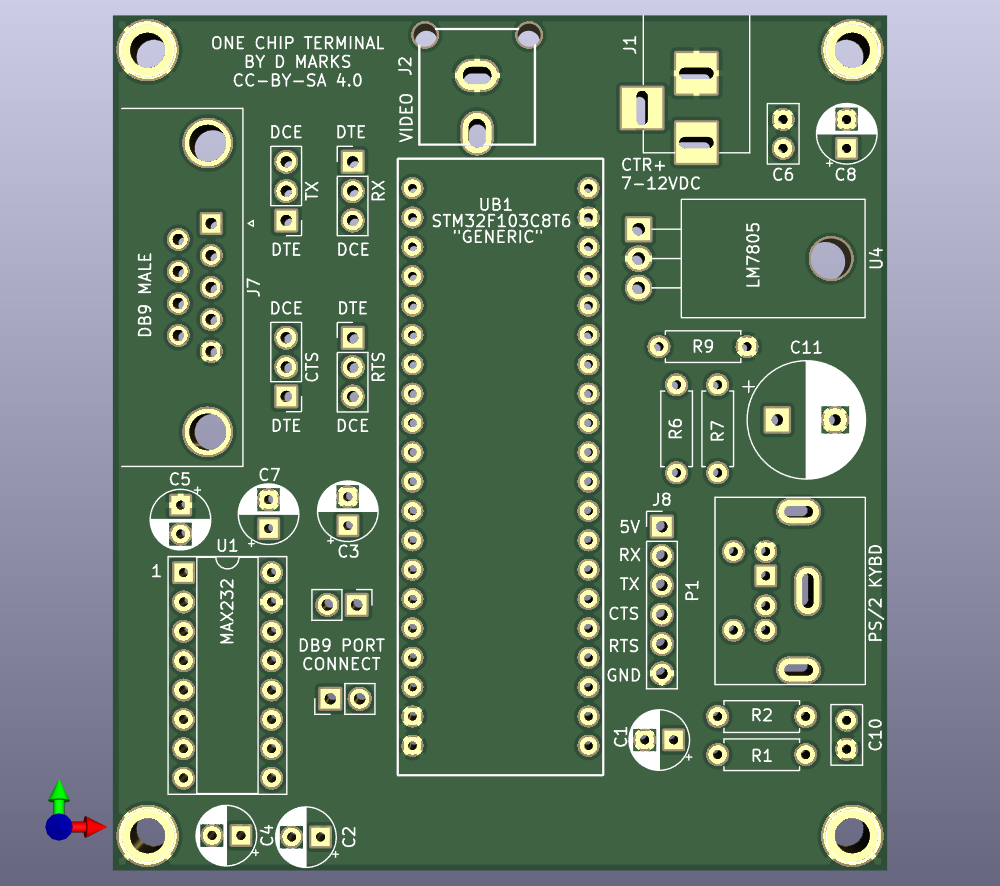
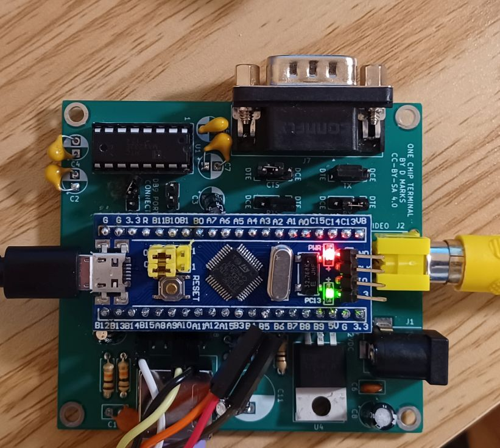
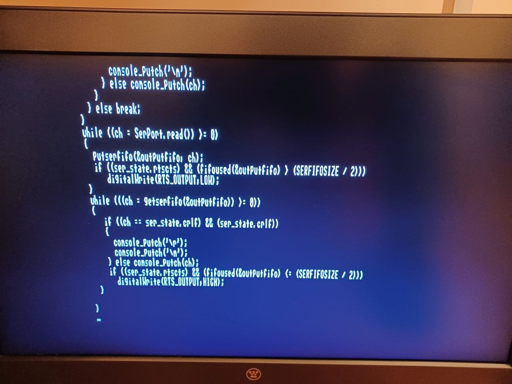

# One Chip Terminal
The One Chip Terminal by Daniel L. Marks.

This project is to use a really cheap board, the Bluepill (STM32F103C8T6 or CS32F103C8T6) to implement a VT100/ANSI terminal for a television set. 
It has NTSC video output which is compatible with many televisions, and uses a PS/2 keyboard input.  The project uses USART1 and implements hardware flow control.
Because it uses the Bluepill project board, it can be implemented with no soldering and incorporated easily into any project.  There is a PCB that may
be used if one desires to add a line-level serial port to it.

There are two compiled firmware files, one for the STM32F103C8T6 and one for the CS32F103C8T6.  Getting one of the clone boards to work is an
exercise in masochism, but it's what is largely available now.

It uses the (somewhat antiquated now) Arduino STM32 libraries:

https://github.com/rogerclarkmelbourne/Arduino_STM32

